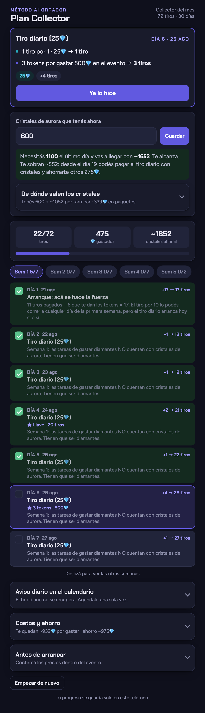
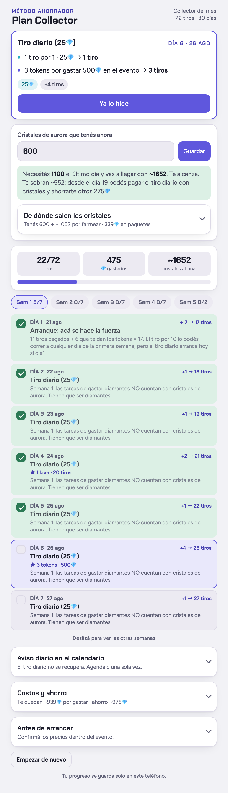

# Plan Collector MLBB

Planificador del método ahorrador para sacar una skin **Collector** o una **Lucky Box**
en Mobile Legends gastando cerca de la mitad de lo que sale comprarla de una.

**→ [Abrir el plan](https://vulzagem.github.io/plan-colector/)**

| Oscuro | Claro |
|:---:|:---:|
|  |  |

## Qué hace

Elegís qué skin querés, las fechas del evento y cuántos cristales de aurora tenés
guardados. A partir de eso arma el plan completo:

- **Qué te toca hoy**, con el costo del día y los tiros que suma.
- **El plan día por día** en un carrusel por semanas, para ir marcando lo cumplido.
- **Cuántos cristales vas a tener** el último día, contando lo que ya tenés más lo
  que falta farmear, y si te alcanzan o te faltan.
- **Cuántos diamantes te quedan por gastar**, que baja a medida que avanzás.
- **Un aviso diario** para el calendario del teléfono, porque el tiro de cada día
  es lo único que no se puede recuperar.

## Cómo funciona por dentro

Es un solo archivo HTML sin dependencias ni build. No hay servidor, no hay cuentas
y no se envía nada a ningún lado: el progreso se guarda en el `localStorage` del
navegador de cada persona, así que cada uno lleva su propio plan.

## Ojo con los números

En cada evento Mobile Legends cambia precios, tokens y tareas. Antes de arrancar,
confirmá dentro del juego que los tiros cuesten 25💎 sueltos y 350💎 los 10, y que
la skin salga 720, 800 o 640 monedas. Si algo cambió, el plan sirve como guía de
ritmo pero los totales no van a dar.

Los cristales de los paquetes salen al azar (entre 10 y 50 por día), así que todo
lo que muestra son promedios: el número real se mueve.
